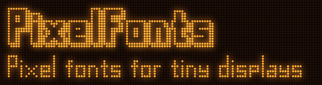

PixelFont is a family of AdafruitGFX compatible fonts, hand crafted for tiny low-res displays. The fonts are designed
to be slender and condensed to fit as much text on a line as possible. And to also look awesome.

You can also use AI to scale the fonts up to add spacing between pixels, makes pixels larger, rounded etc. So it’s a great way to make a faux-low-res display or a retro arcade kind of look.

The library is compatible with AdafruitGFX, u8g2 to be added later.

## Language support

PixelFont includes extended latin but you need to use a [UTF-8 fork of AdafruitGFX](https://github.com/DoomHammer/Adafruit-GFX-Library/tree/enable-utf-8). Supported languages are: English,
Spanish, French, Italian, Czech and more. With the mainline AdafruitGFX, the extended latin won't work.

Please note that I have personally hand-crafted only the Czech special characters. Other extended Latin glyphs are AI
generated, so PRs with corrections from native speakers are welcome!

## Usage

```cpp
#include <PixelFonts.h>   // every font; the ones you do not use take no flash

display.setFont(&pixelfont_13x7_semibold);
display.setTextColor(BLACK);
display.setCursor(10, 30);
display.print("Temperature 23.5");
```

## Fonts

Names follow `pixelfont[_3d | _3d_condensed][_extended_latin]_ROWSxCOLS_WEIGHT`:

- `ROWSxCOLS` - size of the letter grid in pixels: capital height x capital width
- `WEIGHT` - stroke width: `thin` = 1px, `semibold` = 2px, `bold` = 3px
- `_3d` - outline + shadow version, 3 px taller, 1 px gap between characters and lines
- `_3d_condensed` - the same 3D version with no gap between characters and lines
- `_extended_latin` - adds the accented letters and punctuation (see Language support)

In the table: **Height** = pixel height of the capitals (3D versions include the outline and shadow), **Weight** =
stroke width, **English** = ASCII only, **Extended Latin** = ASCII + accented letters.

### 

| Height | Weight | English | Extended Latin |
|---|---|---|---|
| 5 px | 1px | `pixelfont_5x5_thin` | - |
| 7 px | 1px | `pixelfont_7x5_thin` | `pixelfont_extended_latin_7x5_thin` |
| 9 px | 1px | `pixelfont_9x5_thin` | `pixelfont_extended_latin_9x5_thin` |
| 11 px | 1px | `pixelfont_11x5_thin` | `pixelfont_extended_latin_11x5_thin` |
| 13 px | 1px | `pixelfont_13x5_thin` | `pixelfont_extended_latin_13x5_thin` |
| 13 px | 1px | `pixelfont_13x7_thin` | `pixelfont_extended_latin_13x7_thin` |
| 13 px | 2px | `pixelfont_13x7_semibold` | `pixelfont_extended_latin_13x7_semibold` |
| 17 px | 1px | `pixelfont_17x5_thin` | `pixelfont_extended_latin_17x5_thin` |
| 17 px | 2px | `pixelfont_17x5_semibold` | `pixelfont_extended_latin_17x5_semibold` |
| 17 px | 3px | `pixelfont_17x7_bold` | `pixelfont_extended_latin_17x7_bold` |
| 21 px | 1px | `pixelfont_21x11_thin` | `pixelfont_extended_latin_21x11_thin` |
| 21 px | 3px | `pixelfont_21x11_bold` | `pixelfont_extended_latin_21x11_bold` |

### 

| Height | Weight | English | Extended Latin |
|---|---|---|---|
| 8 px | 1px | `pixelfont_3d_5x5_thin` | - |
| 8 px | 1px | `pixelfont_3d_condensed_5x5_thin` | - |
| 10 px | 1px | `pixelfont_3d_7x5_thin` | `pixelfont_3d_extended_latin_7x5_thin` |
| 10 px | 1px | `pixelfont_3d_condensed_7x5_thin` | `pixelfont_3d_condensed_extended_latin_7x5_thin` |
| 12 px | 1px | `pixelfont_3d_9x5_thin` | `pixelfont_3d_extended_latin_9x5_thin` |
| 12 px | 1px | `pixelfont_3d_condensed_9x5_thin` | `pixelfont_3d_condensed_extended_latin_9x5_thin` |
| 14 px | 1px | `pixelfont_3d_11x5_thin` | `pixelfont_3d_extended_latin_11x5_thin` |
| 14 px | 1px | `pixelfont_3d_condensed_11x5_thin` | `pixelfont_3d_condensed_extended_latin_11x5_thin` |
| 16 px | 1px | `pixelfont_3d_13x5_thin` | `pixelfont_3d_extended_latin_13x5_thin` |
| 16 px | 1px | `pixelfont_3d_condensed_13x5_thin` | `pixelfont_3d_condensed_extended_latin_13x5_thin` |
| 16 px | 1px | `pixelfont_3d_13x7_thin` | `pixelfont_3d_extended_latin_13x7_thin` |
| 16 px | 1px | `pixelfont_3d_condensed_13x7_thin` | `pixelfont_3d_condensed_extended_latin_13x7_thin` |
| 16 px | 2px | `pixelfont_3d_13x7_semibold` | `pixelfont_3d_extended_latin_13x7_semibold` |
| 16 px | 2px | `pixelfont_3d_condensed_13x7_semibold` | `pixelfont_3d_condensed_extended_latin_13x7_semibold` |
| 20 px | 1px | `pixelfont_3d_17x5_thin` | `pixelfont_3d_extended_latin_17x5_thin` |
| 20 px | 1px | `pixelfont_3d_condensed_17x5_thin` | `pixelfont_3d_condensed_extended_latin_17x5_thin` |
| 20 px | 2px | `pixelfont_3d_17x5_semibold` | `pixelfont_3d_extended_latin_17x5_semibold` |
| 20 px | 2px | `pixelfont_3d_condensed_17x5_semibold` | `pixelfont_3d_condensed_extended_latin_17x5_semibold` |
| 20 px | 3px | `pixelfont_3d_17x7_bold` | `pixelfont_3d_extended_latin_17x7_bold` |
| 20 px | 3px | `pixelfont_3d_condensed_17x7_bold` | `pixelfont_3d_condensed_extended_latin_17x7_bold` |
| 24 px | 1px | `pixelfont_3d_21x11_thin` | `pixelfont_3d_extended_latin_21x11_thin` |
| 24 px | 1px | `pixelfont_3d_condensed_21x11_thin` | `pixelfont_3d_condensed_extended_latin_21x11_thin` |
| 24 px | 3px | `pixelfont_3d_21x11_bold` | `pixelfont_3d_extended_latin_21x11_bold` |
| 24 px | 3px | `pixelfont_3d_condensed_21x11_bold` | `pixelfont_3d_condensed_extended_latin_21x11_bold` |

## Notes
Glyph data in a simple txt form is included, so you can use AI to generate different formats than AdafruitGFX, for example u8g2.